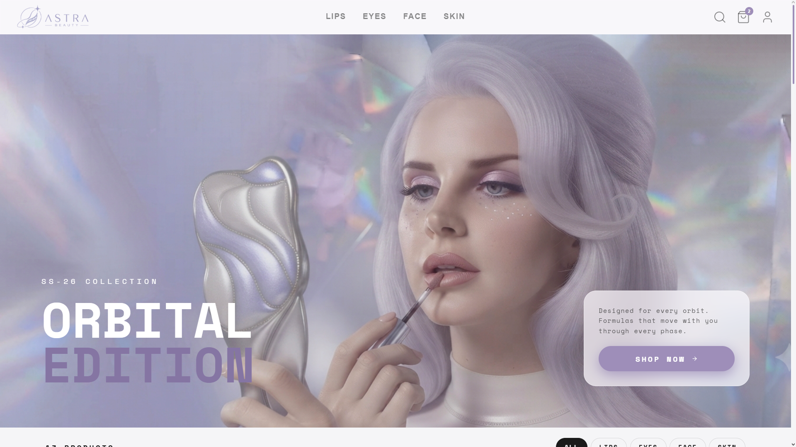
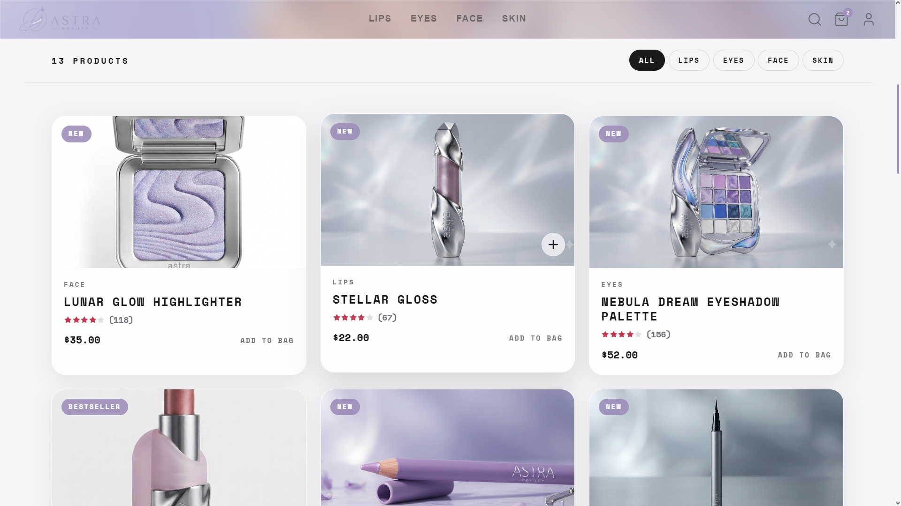
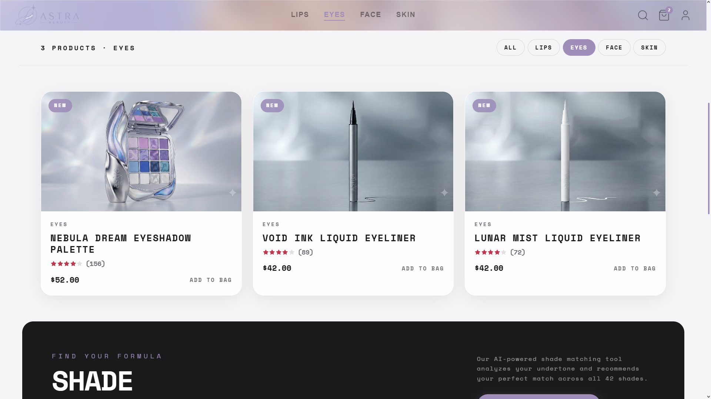
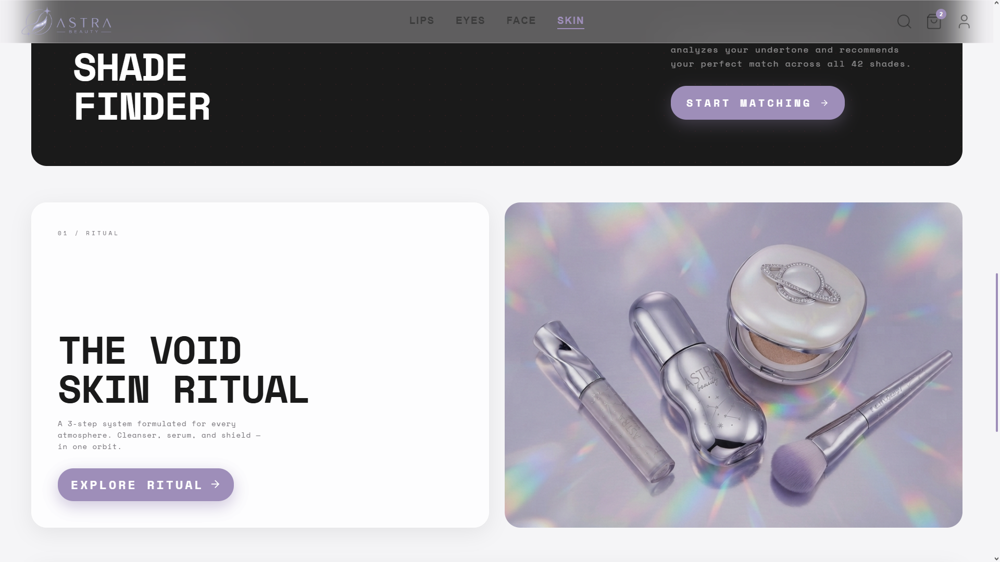

# ✨ Astra Beauty

Astra Beauty is a modern luxury beauty e-commerce frontend built with React, JavaScript, HTML, and CSS. Inspired by brands like REM Beauty and contemporary editorial design, the project focuses on creating a premium shopping experience through minimalist layouts, soft glassmorphism, futuristic aesthetics, and elegant microinteractions.

The interface combines immersive full-screen hero sections, smooth animations, responsive product browsing, and carefully crafted UI components to deliver an experience that feels refined, lightweight, and visually cohesive across desktop and mobile devices.

Astra Beauty was created as a practice project to strengthen frontend development skills, UI/UX implementation, animation techniques, component-based architecture, and modern e-commerce design principles using React.


## ✨ Features

- 💄 Modern luxury beauty storefront
- 🛍️ Product catalog with category filtering
- 🛒 Dynamic shopping cart
- 🎠 Fullscreen hero carousel
- ✨ Glassmorphism UI components
- 🌙 Editorial-inspired minimalist design
- 💫 Smooth page transitions & microinteractions
- 📱 Fully responsive layout
- ⚡ Fast performance powered by Vite


## 🧰 Tech Stack

- React
- React Router
- Swiper.js
- CSS (Custom)
- CSS Tailwind
- React Icons
- Framer Motion


## ⚙️ Notes

- This project was bootstrapped with Vite.
- The UI was designed from scratch with Figma, inspired by premium beauty, retro space, metalic dust and luxury fashion brands.
- All assets are for educational and portfolio purposes.


## 🚀 Live Demo

👉 https://astra-beauty.vercel.app


## 📸 Screenshots

### Landing Page



### Navbar & Products Listing

[Navbar](./public/screenshots/navbar-1.png)
[Navbar](./public/screenshots/navbar-2.png)
[Navbar](./public/screenshots/navbar-3.png)

### Product Details

[Product](./public/screenshots/product-1.png)
[Product](./public/screenshots/product-2.png)
[Product](./public/screenshots/product-3.png)

### Home & Sections






## 📦 Installation

```bash
git clone https://github.com/walterbardier/astra-beauty.git

cd astra-beauty

npm install

npm run dev
```